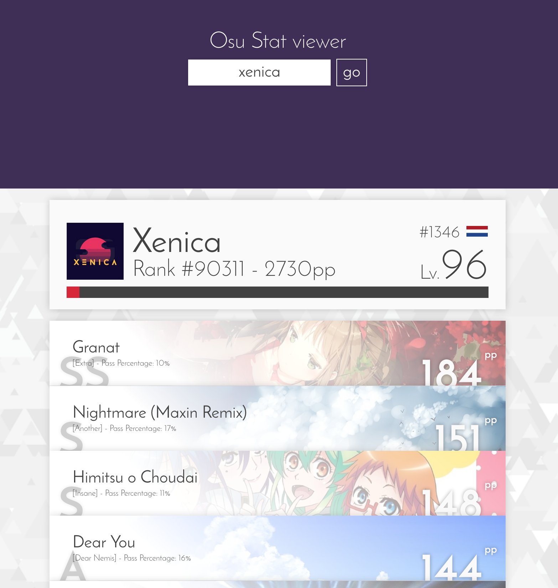
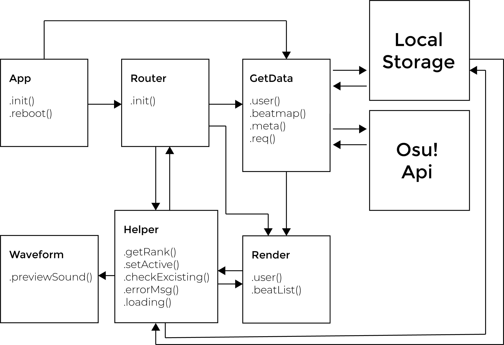
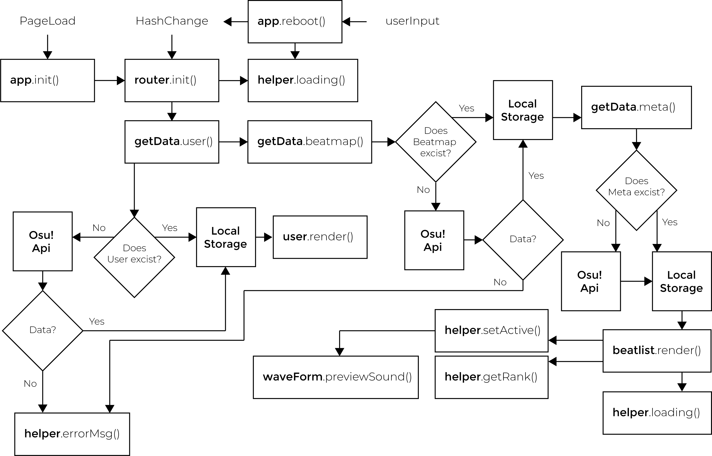

# Webapp from scatch with OSU! api

This app uses the [OSU!](https://osu.ppy.sh/) api to fetch game data.
With this app you can review your in-game performance.



## Demo link

[Link](https://senpaizuri.github.io/web-app-from-scratch-18-19/week1/) to the project

**note:** the demo doesn't work outrught since the API key is bound to my own OSU! account. Both the key and the account may be comprimised if the key is shown in public.

## Api requests

This app fetches the following data

* User data (Username, Level, Experience, Global ranking)
* Beatmap data (Performance of the user by said user)
* Metadata (Data on the played beatmaps)

[Link](https://github.com/ppy/osu-api/wiki) to the api github

## API restrictions
 
> Use the API for good. Don't overdo it. If in doubt, ask before (ab)using :). this section may expand as necessary.
>Current rate limit is set at an insanely high 1200 requests per minute, with burst capability of up to 200 beyond that. If you require more, you probably fall into the above category of abuse. If you are doing more than 60 requests a minute, you should probably give peppy a yell.

[source](https://github.com/ppy/osu-api/wiki#terms-of-use)

## Design patterns JS

the patterns that I'm using for clean coding

- camelCasing
- objectLiterals
- no ";"
- doubleTabs
- single vars/const/let
- enter after variable/const declaration
- no spaces for parameters
- arrow functions
- ES6 Modules

```javascript
import * as render from "../modules/render.js"

let
    newLi = document.createElement('li'),
    newGra= document.createElement('div'),
    app = {
        init: (e)=>{
            // do something
        }
    }

```

## Actor Diagram



## Interaction Diagram



## Feature list

### Feature requirements by this course

*Week 1*
- Creating a webapp from scratch
- Rendering a list of data from the api 🐒
- Loading said data asynchronous

*Week 2*
- Creating an actor and interaction diagram
- Refactoring code to uphold better standards 🛠
- Implement routing

*Week 3*
- Manipulate the api data
- User feedback, Ux tweaks
- Split code up into modules 🎁

### Features that go beyond the minimum requirements

- Saving data to localstorage to minimize loading times
- Assisting many folks with questions and issues
- A somewhat useable interface
- Minor error handeling if the request fails

## MicroLibaries used

- [routie.js](http://projects.jga.me/routie/) for handeling routes

## WishList

[x] Score list, a detailed per beatmap view of the users performance vs the world
[x] Expand the users data to detail more statistics