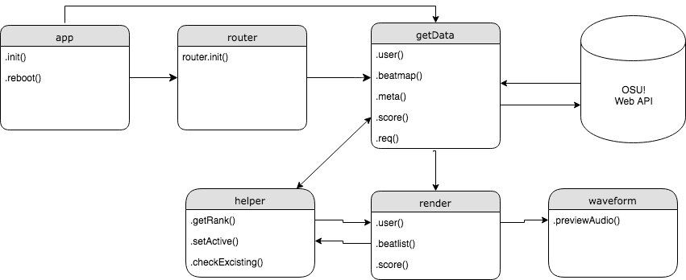

# Week 1 - Hello API 🐒

Doel: Data ophalen uit een API en renderen in een overzichtspagina.

[Opdrachten](https://drive.google.com/open?id=1OVhWQNaCgSluYviTKKWcApkyPd23xow1PiExb8GYANM)

[Slides](https://drive.google.com/open?id=1Rjl9xqXoKniQSRJPdkU1O5YwWC33SJK8KiV0a-H_xZU)

# Webapp with OSU! api

[Link](https://senpaizuri.github.io/web-app-from-scratch-18-19/week1/) to the project

[Link](https://github.com/ppy/osu-api/wiki) to the api github

This app uses the [OSU!](https://osu.ppy.sh/) api to fetch game data.
The beatmap and metadata from the the user is being fetched and displayed with this app.

## Api requests

This applet fetches the following data

* User data (Username, Level, Experience, Global ranking ect.)
* Beatmap data (Performance of the user by said user)
* Metadata (Data on the played beatmaps)

The applet uses a few object literal functions to make the code abit more readable and maintainable.

```javascript

// Used object literal
// Gets data from the api
    getData.user() 
    getData.beatmap()
    getData.metadata()
// Renders the data recieved from the api
    render.user() 
    render.beatmap()
// Helper functions to fix api data or does minor tasks
    helper.getRank()

```

## API restrictions
 
> Use the API for good. Don't overdo it. If in doubt, ask before (ab)using :). this section may expand as necessary.
>Current rate limit is set at an insanely high 1200 requests per minute, with burst capability of up to 200 beyond that. If you require more, you probably fall into the above category of abuse. If you are doing more than 60 requests a minute, you should probably give peppy a yell.

[source](https://github.com/ppy/osu-api/wiki#terms-of-use)

## Design patterns JS

the patterns that I try to use are

- camelCasing
- objectLiterals
- no ";"
- doubleTabs
- single vars/const
- enter after variable/const declaration
- no spaces for parameters

```javascript
var
    newLi = document.createElement('li'),
    newGra= document.createElement('div')

    getData = {
        user:async (data)=>{
            // do something
        }
    }

```

## Actor Diagram



## Todo list

I still need to add an overview where you can view the user data per beatmap against the top 50 scores on the selected beatmap.